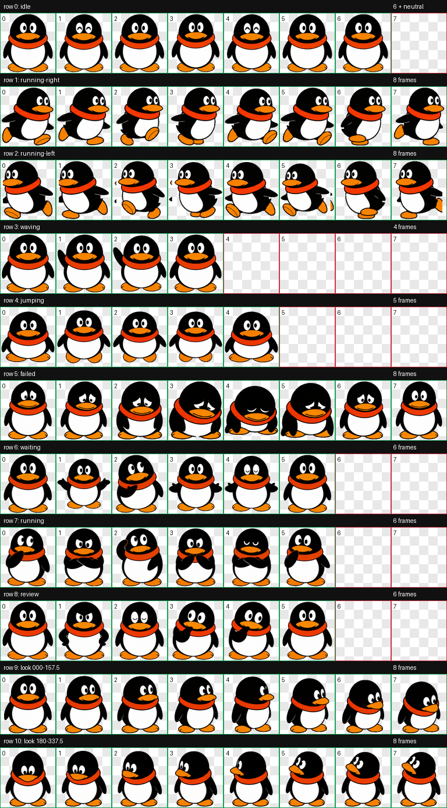
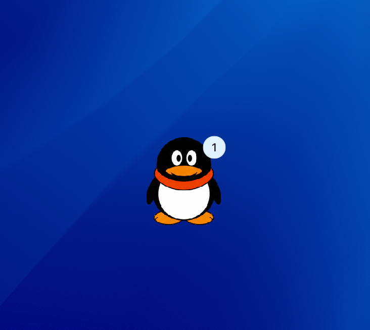

# QQ Penguin Codex Pet

[中文](#中文) · [English](#english)



## 桌面效果 / Desktop Preview

在 Codex 桌面中的实际显示效果。 / The pet as it appears on the Codex desktop.



## 中文

一个可用于 Codex 的圆润企鹅动画宠物：橙色围巾、喙和脚掌，包含待机、移动、挥手、跳跃、失败、等待、工作、审阅及 16 向视线动作。

### 一点情怀

还记得那个曾在桌面角落摇摇晃晃、陪我们聊天和长大的小企鹅吗？这只 Codex Pet 想把那份简单、热闹又温暖的互联网记忆，带回今天的编码时光里。

### 安装

克隆或下载本仓库，将整个目录复制到 Codex 宠物目录：

```text
~/.codex/pets/qq-penguin/
```

目录中应包含：

```text
pet.json
spritesheet.webp
```

重启或刷新 Codex 后，在宠物列表中选择 **QQ Penguin**。

### 资源格式

- Codex Pet v2 (`spriteVersionNumber: 2`)
- 8 × 11 spritesheet
- 透明 WebP 精灵图
- 9 个标准状态 + 16 个环视方向

### 免责声明

这是非官方的粉丝创作，灵感来自广为人知的企鹅视觉风格；与腾讯、QQ 或其关联方不存在隶属、赞助或认可关系。`QQ` 及相关标识可能是其各自权利人的商标。请仅在你拥有相应权利或获准的情况下使用、修改或再发布。

## English

A cheerful animated penguin pet for Codex, featuring an orange scarf, beak, and feet. It includes idle, running, waving, jumping, failure, waiting, working, reviewing, and 16-direction look animations.

### A Little Nostalgia

Remember the little penguin that once waddled in the corner of our desktops and grew up alongside our online conversations? This Codex Pet brings a small piece of that simple, lively, and comforting internet memory into today's coding sessions.

### Installation

Clone or download this repository, then copy the entire directory to your Codex pets folder:

```text
~/.codex/pets/qq-penguin/
```

The directory should contain:

```text
pet.json
spritesheet.webp
```

Restart or refresh Codex, then select **QQ Penguin** from the pet list.

### Asset Format

- Codex Pet v2 (`spriteVersionNumber: 2`)
- 8 × 11 spritesheet
- Transparent WebP sprites
- 9 standard states + 16 look directions

### Disclaimer

This is an unofficial fan-made project inspired by a widely recognized penguin aesthetic. It is not affiliated with, sponsored by, or endorsed by Tencent, QQ, or their affiliates. `QQ` and related marks may be trademarks of their respective owners. Use, modify, or redistribute this project only when you have the appropriate rights or permission.

## License

Original code and configuration in this repository are released under the [MIT License](LICENSE). No rights to third-party trademarks, characters, or visual elements are granted by this license.
